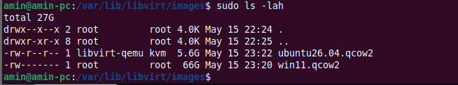
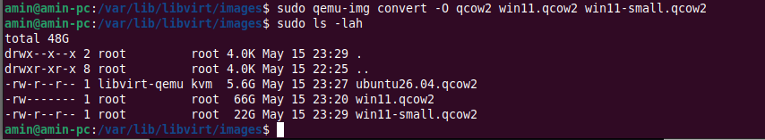

# Reduce the size of existing virtual disks
#qemu #vm #disk

Step
1. Go to /var/lib/libvirt/images
```sh
cd /var/lib/libvirt/images
```
2. See the images
```sh
sudo ls -lah
```


3. Create a copy from existing images
```sh
qemu-img convert -O qcow2 win11.qcow2 win11-small.qcow2
```

*) See, the size of new image smaller than the original

4. Delete old image
5. Rename the new image to old imaga name


## Source
- [Ekiwi Blog](https://ekiwi-blog.de/en/68720/virt-manager-create-and-convert-dynamically-growing-hard-drives-with-qcow2/)